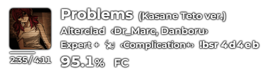
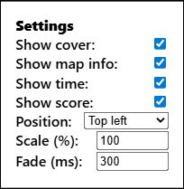

# Beat Saber Overlay

Simple Beat Saber stream overlay for [twitch.tv/iza_k](https://www.twitch.tv/iza_k)  
Requires [BeatSaberPlus](https://github.com/hardcpp/BeatSaberPlus)

### Preview



## Usage

1. Go to [bs-overlay.netlify.app](https://bs-overlay.netlify.app/)
2. Click anywhere on page to show settings (saved in URL)  
   
3. Copy URL
4. OBS Studio: Add Source > Browser > paste URL
5. BeatSaber+ settings, enable the Song Overlay module

### Advanced

[Download](https://github.com/ibillingsley/BeatSaber-Overlay/archive/refs/heads/main.zip) the source code to use the overlay locally without hosting it online.

Note: in OBS browser source, use URL `file:///C:/path-to-overlay.../index.html` instead of "Local file" so that URL parameters work.

You can further customize the overlay with Custom CSS. Example:

```css
body { font-family: "Comic Sans MS"; }
```
